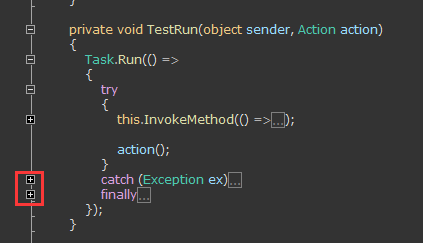
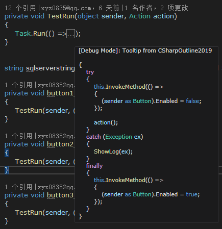

# CSharpOutline2019

An extension for Visual Studio 2019 to add curly braces outlining for C# editor, **especially those braces in the catch & finally block**. It's better to disable built-in outlining.

>Tools-Option-Text Editor-C#-Advanced-Outlining, uncheck 'Show outlining of declaration level constructs' and 'Show outlining of code level constructs'

All the code comes from https://github.com/Skybladev2/C--outline-for-Visual-Studio , with some minor changes.

  
## 2020-09-26 Update

- Implement tooltip with color and format which matches the theme of Visual Studio.
  

