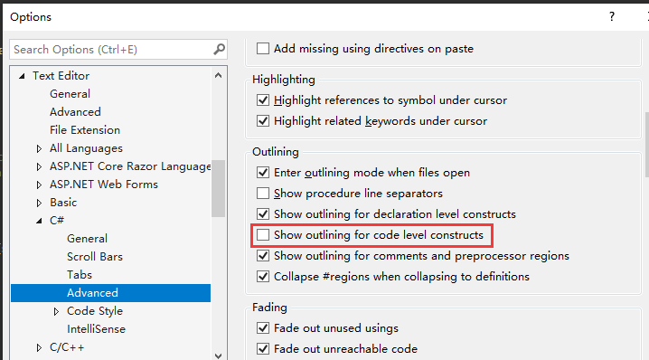

# CSharpOutline2019

----

An extension for Visual Studio 2017/2019 to add curly braces outlining for C# editor, **especially those braces in the catch & finally block**. It's better to disable built-in outlining.

>Tools-Option-Text Editor-C#-Advanced-Outlining, uncheck  `Show outlining of code level constructs`

The code of CSharpOutliningTagger comes from [C# outline 2010](https://github.com/Skybladev2/C--outline-for-Visual-Studio) and [C# outline 2015](https://github.com/Skybladev2/CSharpOutline2015), with some changes.

  
## 2020-09-26 Update

- Implement tooltip with color and format which matches the theme of Visual Studio.  
 
 

>Code of this part comes from [Roslyn](https://github.com/Trieste-040/https-github.com-dotnet-roslyn/blob/2d22d1aa4f1dfe3ae6f8de8cb7ddc218a5f1c4ff/src/EditorFeatures/Core/Implementation/Structure/BlockTagState.cs)

## 2020-09-28 Update

- Collapse multiple lines of comments

- Collapse some preprocessor commands, like `#if` `#else` `#endif`,  `#region` `#endregion`

## 2020-10-12 Update

- Collapse `using`

## 2020-10-14 Update

- Collapse `case` & `default` in `switch` block

## 2020-10-27 Update

- Support Visual Studio 2017

----

Visual Studio 2017/2019 扩展，主要功能如下

- 折叠花括号，特别是catch和finanlly块里的。 虽然2017以后的VS自带代码级别的折叠，但是不能折叠catch及finally里的
  

- 折叠多行注释。 VS只能折叠 `summary`注释

- 折叠预处理命令，比如 `#if` `#else` `#endif`,  `#region` `#endregion`。 主要是VS不折叠`#if` `#else` `#endif`

- 折叠 `switch` 里的 `case` & `default`

### 这几项功能和VS自带的功能有所重叠，所以需要取消勾选以下选项

>工具-选项-文本编辑器-C#-高级-大纲，取消勾选 `显示代码级别构造的大纲`

代码主要来源于两个地方

- 折叠区域部分来源于 [C# outline 2010](https://github.com/Skybladev2/C--outline-for-Visual-Studio) 及 [C# outline 2015](https://github.com/Skybladev2/CSharpOutline2015)
- 带有着色效果的预览Tooltip 来自 [Roslyn](https://github.com/Trieste-040/https-github.com-dotnet-roslyn/blob/2d22d1aa4f1dfe3ae6f8de8cb7ddc218a5f1c4ff/src/EditorFeatures/Core/Implementation/Structure/BlockTagState.cs)

